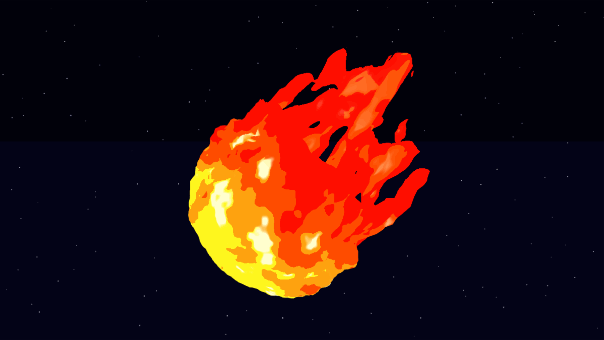
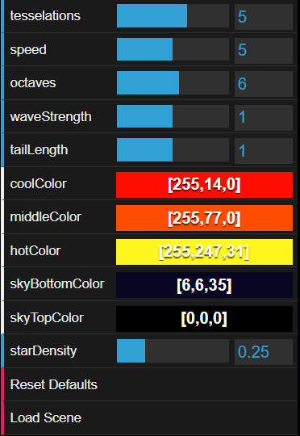

# HW 1: WebGL Fireball

A stylized fireball falling through the night sky, built with WebGL 2 and procedural shaders.

[Live Demo](https://jamesliu12.github.io/hw01-fireball/)



## Features

- Animated surface displacement and a flickering flame tail.
- Layered flame colors with moving patches and bright highlights.
- An animated night sky with scrolling stars.
- Interactive shape, color, and background controls.

## Controls



| Control | What it does |
| --- | --- |
| `tesselations` | Sets mesh subdivisions (0-8). |
| `speed` | Changes animation speed (0-10); 0 pauses. |
| `octaves` | Sets vertex fBm layers (1-10). |
| `waveStrength` | Scales surface displacement (0-2). |
| `tailLength` | Adjusts tail stretch (0-2). |
| `coolColor` | Sets the coolest flame color. |
| `middleColor` | Sets the middle flame color. |
| `hotColor` | Sets the hottest flame color. |
| `skyBottomColor` | Sets the bottom sky color. |
| `skyTopColor` | Sets the top sky color. |
| `starDensity` | Changes star density (0-1). |
| `Reset Defaults` | Restores all control values. |
| `Load Scene` | Rebuilds the scene geometry. |

## Implementation

### Fireball: Height Displacement

The vertex shader moves each vertex of an icosphere along its normal:

```glsl
vec3 displacedPos = vs_Pos.xyz + height * normal;
```

The height combines two layers. Animated sine and cosine waves create broad shape changes. Higher-frequency fBm adds smaller surface details using 3D Perlin-style gradient noise. Each octave doubles the frequency and halves the amplitude. Moving the noise sampling position over time makes the surface flow.

A dot product measures how far each vertex points toward the upper right. `smoothstep` and `mix` use this direction to scale displacement from 0.3 near the lower-left head to 1.5 near the upper-right tail. The `waveStrength` control multiplies the result.

### Fireball: Tail

A separate weight selects the upper-right part of the sphere. The stretch is multiplied by `tailLength`, with a small sine wave making it flicker.

The fragment shader uses noise to discard parts of the tail. The discard threshold increases toward the tip, creating broken flame edges.

### Fireball: Noise and Color Layers

The fragment shader uses 3D value noise. Two frequencies are combined with weights of 0.75 and 0.25 to create broad color patches with smaller details. Their sampling coordinates move toward the tail over time.

A `heat` value combines position along the flame, these noise patches, and the height passed from the vertex shader. Lower heights increase heat, linking the colors to the surface displacement.

Thresholds at 0.4, 0.6, and 0.8 divide heat into four color bands: cool, middle, a blend of middle and hot, and hot. The bands have hard boundaries for a cartoon look. High noise values add pale highlights near the head.

### Night Sky

A full-screen square draws a vertical gradient between two sky colors. Pixel coordinates are divided into 40-by-40 cells. Hash values determine each star's position, radius, brightness, and visibility.

Offsetting the sampling coordinates with time makes the stars scroll diagonally. The sky is drawn before the fireball with depth testing and depth writes disabled.

## References

The hash functions are taken or adapted from [pySSV's random.glsl](https://pyssv.readthedocs.io/en/stable/_modules/random.glsl.html), which credits David Hoskins' *Hash without Sine*.

